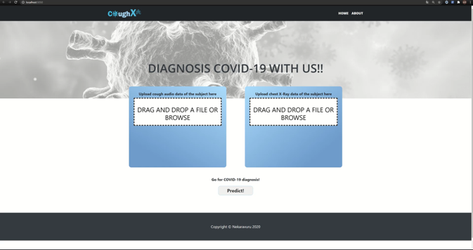

# p2ngdc22

 

  <h3 align="center"><b>2022년 컴투스플랫폼 공채 프로젝트</b></h3>
  

    얼굴 이미지 기반 3D 캐릭터 합성
      
  

<!-- TABLE OF CONTENTS -->

  
Table of Contents

  <ol>
    <li>
      <a href="#about-the-project">About The Project</a>
      <ul>
        <li><a href="#built-with">Built With</a></li>
      </ul>
    </li>
    <li>
      <a href="#branch-structure">Branch Structure</a>
      <ul>
        <li><a href="#dev-branch">Development Branch</a></li>
        <li><a href="#deploy-branch">Deploy Branch</a></li>
      </ul>
    </li>
    <li>
      <a href="#branch-structure">Contacts</a>
    </li>
    <li>
      <a href="#branch-structure">References</a>
    </li>
  </ol>

 

<!-- ABOUT THE PROJECT -->
 

## About The Project
1. 사람 얼굴 이미지를 기반으로 AI를 활용해서 UV 맵을 합성하는 기술 개발

2. 개발된 AI 기술을 기반으로 MVP 사이트 구현

- 참고: [프로젝트 가이드](https://jira.com2us.com/wiki/pages/viewpage.action?pageId=268616336)  

### Built With
- [Python](https://www.python.org/)
- [Pytorch](https://pytorch.org/)
- [Vue.js](https://vuejs.org/)
- [Node.js](https://nodejs.org/ko/)
- [gRPC](https://grpc.io/)
- [Three.js](https://threejs.org/)

(<a href="#top">back to top</a>)

<!-- GETTING STARTED -->

## Branch Structure

### Development Branch

<!-- 서버 관련 설치 패키지 설치 작성 -->

- [dev_Training](https://xgit.withhive.com/leaddevelop/p2ngdc22/-/tree/dev_Training)

  1. 데이터 전처리 코드
  2. 모델 실험 및 학습 코드

- [dev_Front](https://xgit.withhive.com/leaddevelop/p2ngdc22/-/tree/dev_Front)

  1. 웹페이지 개발 코드

### Deploy Branch

- [deploy_Backoffice](https://xgit.withhive.com/leaddevelop/p2ngdc22/-/tree/deploy_Backoffice)

  1. dev_Front에서 build한 static files directory 사용 -> ./public/에 복사
  2. API 서버에서 배포하여 사용

- [deploy_Engine](https://xgit.withhive.com/leaddevelop/p2ngdc22/-/tree/deploy_Engine)

  1. dev_Training에서 학습한 checkpoint 사용
  2. checkpoint 기본 사용경로 /game/www/data/train/checkpoints/
  3. 모델 기반 추론 서버에서 배포하여 사용

(<a href="#top">back to top</a>)

## References

모델 관련 참고 논문
- 초기 모델
  - [3FFFA-V2 (2020)](https://arxiv.org/pdf/2009.09960.pdf): 얼굴 이미지에서 초기 UV 맵을 생성하는 전처리 모듈
  - [UV-GAN (2018)](https://openaccess.thecvf.com/content_cvpr_2018/html/Deng_UV-GAN_Adversarial_Facial_CVPR_2018_paper.html): 초기 UV 맵으로부터 최종 UV 맵을 사용하는 GAN 기반 모델
  - [Attention ResCUNet GAN (2020)](https://hcis-journal.springeropen.com/articles/10.1186/s13673-020-00250-w): UV-GAN의 U-Net 기반 generator를 발전시킨 UV 맵 합성 모델
- 제안 모델
  - [StyleGAN2 (2020)](https://arxiv.org/abs/1912.04958): latent vector로부터 이미지 (UV 맵)를 합성하는 decoder 모듈
  - [pixel2style2pixel (2021)](https://openaccess.thecvf.com/content/CVPR2021/html/Richardson_Encoding_in_Style_A_StyleGAN_Encoder_for_Image-to-Image_Translation_CVPR_2021_paper.html): 얼굴 이미지로부터 latent vector를 합성하는 encoder 모듈

(<a href="#top">back to top</a>)

## Contacts

- 컴투스플랫폼 선행개발팀 AI파트 유건욱 사원 (<gunwook0307@com2us.com>)
- 컴투스플랫폼 선행개발팀 AI파트 이혜빈 사원 (<leehye16@com2us.com>)
- 컴투스플랫폼 선행개발팀 AI파트 정우현 사원 (<kwdg1213@com2us.com>)

(<a href="#top">back to top</a>)

